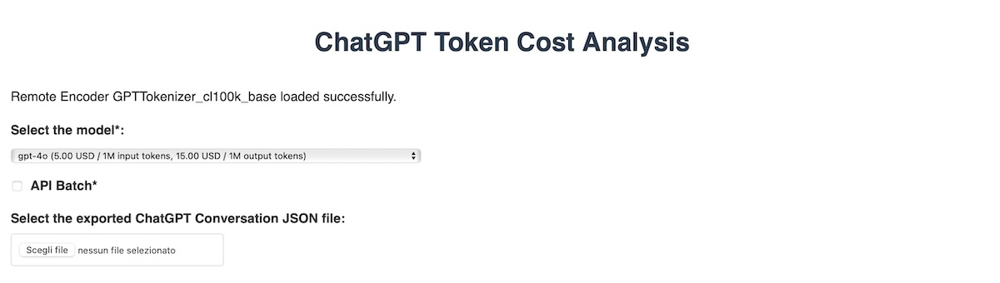
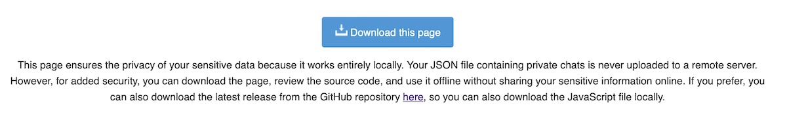
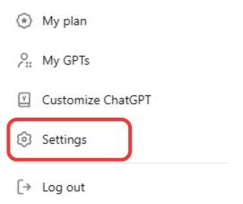
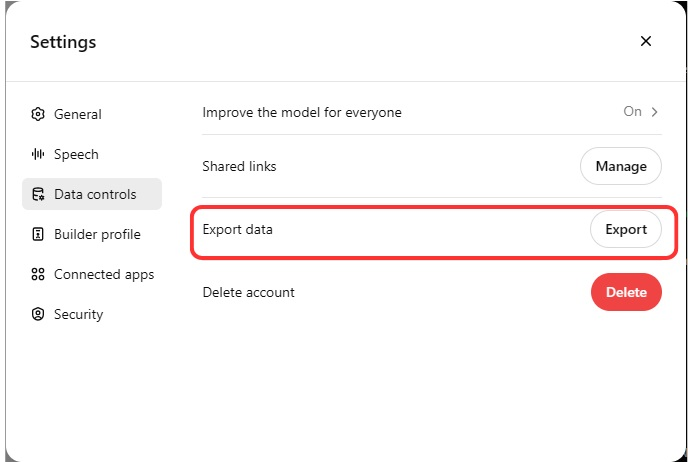
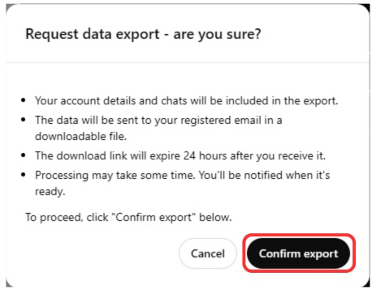

# Analisi dei costi dei token di ChatGPT

 []()
 [](https://opensource.org/licenses/MIT) [](https://github.com/levysoft/chatgpt-token-cost-analysis/graphs/commit-activity) [](https://github.com/levysoft/chatgpt-token-cost-analysis/graphs/contributors/) [](https://www.javascript.com) [](https://www.python.org/) 

[ [English](README.md) | [Italiano](README.it.md) ]
 
Questa repository fornisce strumenti per analizzare i costi associati ai token generati dalle chat esportate di ChatGPT. Include sia uno script Python che una versione HTML per un utilizzo flessibile e migliorato dal punto di vista della privacy.

# Contenuti

1. [Introduzione](#introduzione)
2. [Script Python](#script-python)
3. [Requisiti](#requisiti)
4. [Installazione](#installazione)
5. [Utilizzo](#utilizzo)
6. [Descrizione dello script](#descrizione-dello-script)
7. [Esempio di output](#esempio-di-output)
8. [Versione web-based in HTML + JavaScript](#versione-web-based-in-html--javascript)
9. [Come esportare la cronologia e i dati di ChatGPT](#come-esportare-la-cronologia-e-i-dati-di-chatgpt)
10. [Costi dei modelli](#costi-dei-modelli)
11. [Scopo del progetto e disclaimer](#scopo-del-progetto-e-disclaimer)
12. [Feedback e contributi](#feedback-e-contributi)
13. [Changelog](#changelog)
14. [Autore](#autore)
15. [Licenza](#licenza)

## Introduzione

La repository contiene:
- Uno script Python per l'analisi dettagliata dei costi dei token, che elabora un file JSON delle conversazioni esportate di ChatGPT.
- Un'applicazione HTML + JavaScript che consente l'analisi locale dei costi dei token direttamente in un browser web, garantendo piena privacy e funzionalità offline.

## Script Python
Questa parte della repository contiene uno script Python per analizzare i costi associati ai token generati dalle chat esportate di ChatGPT. Lo script estrae i messaggi da un file JSON, calcola il numero di token utilizzati e determina i costi per i token di input e output. Inoltre, raggruppa i costi per mese e salva i risultati in un file CSV.

## Requisiti

- Python 3.x
- Moduli Python: `json`, `pandas`, `datetime`, `tiktoken`

## Installazione

1. Clona questa repository:
    ```sh
    git clone https://github.com/levysoft/chatgpt-token-cost-analysis.git
    ```
2. Installa i pacchetti richiesti con uno dei seguenti metodi:
    - Metodo 1: Installa i pacchetti specifici
      ```sh
      pip install pandas tiktoken
      ```
    - Metodo 2: Installa i pacchetti utilizzando il file requirements.txt
      ```sh
      pip install -r requirements.txt
      ```

## Utilizzo

1. Posiziona il tuo file `conversations.json` nella directory principale del progetto.
2. Esegui lo script:
    ```sh
    python chatgpt_token_cost_analysis.py
    ```

## Descrizione dello Script

### Variabili Globali

- `cost_per_million_input_tokens`: Costo per milione di token di input (5.00 USD)
- `cost_per_million_output_tokens`: Costo per milione di token di output (15.00 USD)

### Caricamento del File JSON

Lo script carica il file `conversations.json` e gestisce eventuali eccezioni durante il caricamento.

### Estrazione dei Messaggi

La funzione `extract_messages(data)` estrae i messaggi dai dati JSON annidati e li converte in un DataFrame di pandas.

### Calcolo dei Token

La funzione `calculate_tokens(text)` utilizza la codifica `cl100k_base` per calcolare il numero di token in ogni messaggio.

### Calcolo dei Costi

Lo script separa i token di input e output e calcola i costi associati.

I costi totali della chat sono calcolati utilizzando i prezzi API di OpenAI per GPT-4 (https://openai.com/api/pricing/).

I costi sono calcolati separatamente per i token di input (utente) e i token di output (assistente), utilizzando prezzi specifici per GPT-4.

### Output

I risultati sono raggruppati per mese e salvati in un file CSV `costs_per_month.csv`.

## Esempio di Output

```bash
JSON file successfully loaded.
Number of messages extracted: 13694
Data converted to DataFrame.
Token calculation completed.
Cost calculation completed.
Total Input Tokens: 823211
Total Output Tokens: 2281124
Total cost: $38.33
Costs per month:
      month  input_cost  output_cost  input_tokens  output_tokens      cost
17  2024-06    0.251990     2.453400         50398         163560  2.705390
16  2024-05    0.341110     3.739950         68222         249330  4.081060
15  2024-04    0.375340     2.554425         75068         170295  2.929765
14  2024-03    0.452200     3.057330         90440         203822  3.509530
13  2024-02    0.410050     4.956330         82010         330422  5.366380
12  2024-01    0.397070     2.669400         79414         177960  3.066470
11  2023-12    0.156830     1.096485         31366          73099  1.253315
10  2023-11    0.236500     2.278845         47300         151923  2.515345
9   2023-10    0.478100     2.457090         95620         163806  2.935190
8   2023-09    0.156665     1.502850         31333         100190  1.659515
7   2023-08    0.008925     0.276330          1785          18422  0.285255
6   2023-07    0.299655     0.931125         59931          62075  1.230780
5   2023-06    0.308550     2.195280         61710         146352  2.503830
4   2023-05    0.031720     0.388905          6344          25927  0.420625
3   2023-03    0.019850     0.423750          3970          28250  0.443600
2   2023-02    0.041680     0.254055          8336          16937  0.295735
1   2023-01    0.094950     1.419300         18990          94620  1.514250
0   2022-12    0.054870     1.562010         10974         104134  1.616880
```

## Versione Web-Based HTML + JavaScript
Oltre allo script Python, questa repository include un'applicazione HTML + JavaScript a pagina singola che consente a chiunque di analizzare i costi dei token localmente. Questa pagina HTML non utilizza la libreria tiktoken, che non è disponibile in JavaScript, ma piuttosto utilizza la libreria gpt-tokenizer.

### Perché la pagina HTML?

- **Accessibilità**: Questa pagina HTML può essere scaricata ed eseguita localmente da chiunque senza bisogno di configurare un ambiente Python.
- **Supporto Modelli Completo**: A differenza dello script Python, la pagina HTML include il supporto per più modelli con costi di token variabili, consentendo un'analisi più flessibile.
- **Privacy Locale**: La pagina garantisce la privacy dei tuoi dati sensibili perché funziona interamente in locale. Il tuo file JSON contenente chat private non viene mai caricato su un server remoto.

### Utilizzo della pagina HTML

1. **Scarica la Pagina**: Clicca sul link di download sulla pagina per salvarla per l'uso offline.
2. **Seleziona il modello**: Scegli il modello appropriato dal menu a discesa. Puoi scegliere tra tutti i modelli OpenAI disponibili e, in via sperimentale, tra quelli Claude e Gemini.
3. **Carica il tuo file JSON**: Seleziona il tuo file `conversations.json` da analizzare. È stata implementata la validazione del formato JSON per garantire che il file caricato rispetti la struttura richiesta.
4. **Visualizza i Risultati**: I risultati dell'analisi, inclusi i costi totali e mensili, saranno visualizzati direttamente sulla pagina.

Questo strumento web-based fornisce un modo più user-friendly e completo per analizzare i costi dei token per vari modelli e casi d'uso.

### Miglioramento della Privacy e della Funzionalità Offline

Per garantire la privacy dei tuoi dati e fornire funzionalità anche quando offline, la pagina HTML include un meccanismo per caricare l'encoder `GPTTokenizer_cl100k_base` da una fonte locale se il file JavaScript remoto non è accessibile. Per impostazione predefinita, la pagina tenta di caricare il tokenizer dall'URL remoto `https://unpkg.com/gpt-tokenizer`. Se questo file remoto non è disponibile, lo script tenterà di caricare una versione locale del tokenizer (`cl100k_base.js`).

Ecco una breve panoramica di come funziona:

- La funzione `checkGPTTokenizer` tenta prima di caricare l'encoder `GPTTokenizer_cl100k_base` dalla fonte remota.
- Se il file remoto non è accessibile, tenta di caricare il file `cl100k_base.js` locale.
- Se né i file remoti né quelli locali sono disponibili, lo script ricorre a una stima approssimativa basata sul numero di parole nel testo. Questo metodo di fallback, sebbene non altrettanto preciso, fornisce una stima utile dell'utilizzo dei token.

Per utilizzare la versione locale del tokenizer, assicurati di scaricare `cl100k_base.js` e di posizionarlo nella stessa directory del file HTML. Questo approccio garantisce che i tuoi dati rimangano privati e che la funzionalità sia disponibile anche senza una connessione Internet.

Questo miglioramento rende lo strumento più conforme alla privacy e garantisce che gli utenti possano analizzare i loro dati di chat in qualsiasi condizione di rete.

**Nota:** Avrei potuto rendere il file HTML una vera applicazione a pagina singola per l'uso offline includendo direttamente il file JavaScript `cl100k_base.js` nell'HTML. Tuttavia, poiché questo file è piuttosto grande (oltre 2 MB di dati), avrebbe reso il file HTML difficile da leggere e analizzare se visualizzato direttamente.

### Versione Online
Puoi provare la versione online della pagina HTML qui: [https://www.levysoft.it/chatgpt-costs](https://www.levysoft.it/chatgpt-costs). 

### Utilizzo Offline
Puoi sempre scaricare la pagina HTML e usarla localmente e offline. Per fare ciò, assicurati di scaricare anche la libreria JavaScript cl100k_base.js. La pagina funzionerà in totale privacy senza richiedere una connessione Internet.

### Screenshot

Ecco uno screenshot della pagina web:



E qui uno screenshot della pagina dei risultati una volta analizzato il JSON:


Assicurati di scaricare la pagina e usarla offline per massima privacy e sicurezza.



### Come Esportare lo Storico delle Chat di ChatGPT

Per analizzare la cronologia delle tue chat di ChatGPT con i nostri strumenti, devi prima esportare i tuoi dati da ChatGPT. Ecco come puoi farlo:

> 1. Accedi a ChatGPT.
> 2. Nell'angolo in alto a destra della pagina, clicca sulla tua icona del profilo.
> 3. Clicca su **Impostazioni**.
> 
> 
> 
> 4. Vai al menu **Controlli Dati**.
> 5. Sotto **Esporta Dati**, clicca **Esporta**.
> 
> 
> 
> 6. Nella schermata di conferma, clicca **Conferma esportazione**.
> 
> 

Dovresti ricevere un'email con i tuoi dati. Nota che il link nell'email scade dopo 24 ore. Clicca su **Scarica esportazione dati** per scaricare un file `.zip`. Questo file include la cronologia delle tue chat in `chat.html` e altri dati associati al tuo account.

Nel file `.zip`, troverai sia `chat.html` che `conversations.json`. Il file `conversations.json` è quello richiesto per l'elaborazione con i nostri strumenti.

Questa funzionalità è disponibile sia nei piani Free che Plus. Non è disponibile per gli utenti che non si sono connessi.

Per ulteriori dettagli, puoi visitare [Come posso esportare la cronologia e i dati di ChatGPT?](https://help.openai.com/en/articles/7260999-how-do-i-export-my-chatgpt-history-and-data).

Se segui questi passaggi, avrai i tuoi dati di chat pronti per l'analisi utilizzando il nostro script Python o la pagina HTML.

## Costi dei Modelli

La seguente tabella mostra i costi aggiornati per vari modelli al 29 giugno 2024. La pagina HTML è basata su questa tabella. Puoi verificare i prezzi per i modelli OpenAI, Claude e Gemini utilizzando i seguenti link:
- [Prezzi OpenAI](https://openai.com/api/pricing/)
- [Prezzi Claude](https://www.anthropic.com/pricing#anthropic-api)
- [Prezzi Gemini](https://ai.google.dev/pricing)

I costi per i modelli Claude e Gemini sono sperimentali in quanto si prevede che funzionino in modo simile ai modelli GPT in termini di calcolo dei token. Tuttavia, mi riservo di verificare ulteriormente questi costi.

| Gruppo                            | Modello                      | Costo input (USD / 1M token) | Costo output (USD / 1M token) |
|-----------------------------------|------------------------------|------------------------------|-------------------------------|
| **Modello OpenAI GPT-4o**         | gpt-4o                       | 5.00                         | 15.00                         |
|                                   | gpt-4o-2024-05-13            | 5.00                         | 15.00                         |
| **OpenAI GPT-4o mini Model**      | gpt-4o-mini                  | 0.15                         | 0.60                          |
|                                   | gpt-4o-mini-2024-07-18       | 0.15                         | 0.60                          |
| **Modelli OpenAI GPT-3.5 Turbo**  | gpt-3.5-turbo-0125           | 0.50                         | 1.50                          |
|                                   | gpt-3.5-turbo-instruct       | 1.50                         | 2.00                          |
| **Modelli OpenAI Embedding**      | text-embedding-3-small       | 0.02                         | N/A                           |
|                                   | text-embedding-3-large       | 0.13                         | N/A                           |
|                                   | ada-v2                       | 0.10                         | N/A                           |
| **Modelli OpenAI Fine-tuning**    | gpt-3.5-turbo                | 3.00                         | 6.00                          |
|                                   | davinci-002                  | 12.00                        | 12.00                         |
|                                   | babbage-002                  | 1.60                         | 1.60                          |
| **Modelli OpenAI Older**          | gpt-4-turbo                  | 10.00                        | 30.00                         |
|                                   | gpt-4-turbo-2024-04-09       | 10.00                        | 30.00                         |
|                                   | gpt-4                        | 30.00                        | 60.00                         |
|                                   | gpt-4-32k                    | 60.00                        | 120.00                        |
|                                   | gpt-4-0125-preview           | 10.00                        | 30.00                         |
|                                   | gpt-4-1106-preview           | 10.00                        | 30.00                         |
|                                   | gpt-4-vision-preview         | 10.00                        | 30.00                         |
|                                   | gpt-3.5-turbo-1106           | 1.00                         | 2.00                          |
|                                   | gpt-3.5-turbo-0613           | 1.50                         | 2.00                          |
|                                   | gpt-3.5-turbo-16k-0613       | 3.00                         | 4.00                          |
|                                   | gpt-3.5-turbo-0301           | 1.50                         | 2.00                          |
|                                   | davinci-002                  | 2.00                         | 2.00                          |
|                                   | babbage-002                  | 0.40                         | 0.40                          |
| **Modelli Claude (Sperimentali)** | Claude 3 Haiku               | 0.25                         | 1.25                          |
|                                   | Claude 3 Sonnet              | 3.00                         | 15.00                         |
|                                   | Claude 3 Opus                | 15.00                        | 75.00                         |
|                                   | Claude 2.1                   | 8.00                         | 24.00                         |
|                                   | Claude 2.0                   | 8.00                         | 24.00                         |
|                                   | Claude Instant               | 0.80                         | 2.40                          |
| **Modelli Gemini (Sperimentali)** | Gemini 1.5 Flash             | 0.35                         | 1.05                          |
|                                   | Gemini 1.5 Pro               | 3.50                         | 10.50                         |
|                                   | Gemini 1.0 Pro               | 0.50                         | 1.50                          |

## Scopo del Progetto e Disclaimer

Lo scopo di questo progetto è puramente indicativo ed è pensato per soddisfare la curiosità personale. Non deve essere considerato uno strumento ufficiale o definitivo. È fondamentale utilizzarlo con consapevolezza dei suoi limiti e non fare affidamento su di esso per decisioni critiche o professionali.

## Feedback e Contributi

Il tuo feedback è molto apprezzato! Se hai suggerimenti, bug da segnalare o miglioramenti, sentiti libero di aprire un issue o una pull request nel repository GitHub. Se desideri contribuire al progetto, le pull request sono benvenute.

## Changelog

Puoi trovare tutte le modifiche e le versioni del progetto nel [CHANGELOG.md](./CHANGELOG.md).

## Autore

Antonio Troise

## Licenza

Questo progetto è rilasciato sotto la licenza MIT. Vedi il file LICENSE per maggiori dettagli.
